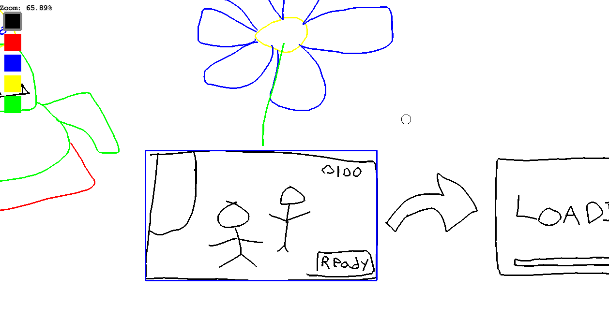

# Whiteboard

A vector drawing app for sketching ideas and such. 

## Features
- Press 'P' to select the pencil tool or choose another color
    - Left click to draw
- Press 'S' to enter selection mode
    - Click and drag a selection to move it
    - Press 'S' again to unselect
- Right click to erase
- Space + mouse drag moves the canvas
- Mouse wheel to zoom in/out

## What you won't find :(
- Saving/loading to file
- The ability to see what you're sketching????
- Resizing a selection
- Undo/redo actions

# Building
The program uses the [Slick2D](https://slick.ninjacave.com/) library. Everything should be included in the vendor/ directory. I just let Microsoft's [Extension Pack for Java](https://marketplace.visualstudio.com/items?itemName=vscjava.vscode-java-pack) do its magic.

# License 
Read the LICENSE file